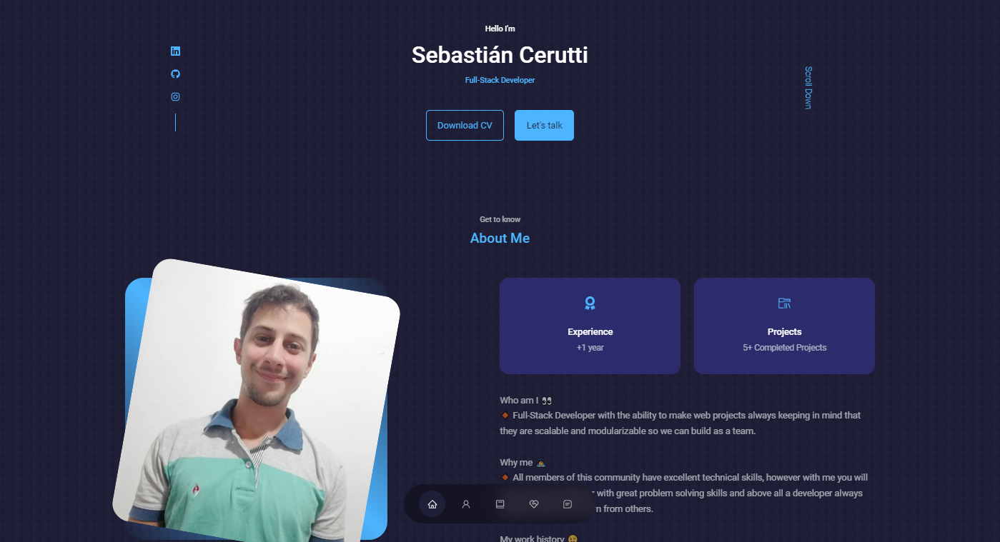

# Personal-Portfolio
> This is personal portfolio website.



## Built With

- React
- CSS

## Live Demo

- [Live Demo](https://portfolio-scerutti.vercel.app)


# Getting Started
## Prerequisites:


- Create an account on github

- Install gitbash or use git on the command line.

- Use an IDE of your preference such as VScode.

## Steps to follow:

- Choose a folder in your local machine where you want this repository to be copied

- Clone this [repository](https://github.com/Scerutti/Portfolio.git) to your local machine 
- ```
  git clone git@github.com:Meri-MG/portfolio---react.git
  ```

- Navigate to `cd portfolio` directory.

- To install all the app dependencies on the command line run
- ```
  npm install
  ``` 
- To run app in the development mode run 
- ```
  npm start
  ```


## Author

:men: **Sebastián Cerutti**

- [GitHub](https://github.com/Scerutti)
- [LinkedIn](https://www.linkedin.com/in/cerutti-sebastiáng/)

# Show your support
Give a ⭐ if you like this project!
